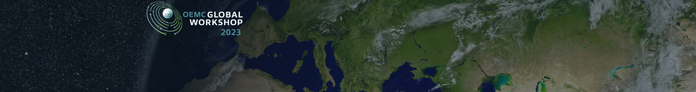

# GEO Knowledge Hub @ Open Earth Monitor — Global Workshop 2023

Earth Observation (EO) applications enable decision-makers, researchers, and specialists to understand the phenomena of our planet, allowing global changes to be made from local actions taken by the public and private sectors. With the dissemination and use of Open Data practices, the EO applications have been enhanced, allowing numerous works to be developed, ranging from the analysis of anthropic actions on inland waters to the temporal analysis of land use and land cover changes. These advances and improvements in EO applications have made their development complex, requiring several materials to be used together with the data to compose the results. Consequently, organizing, sharing, and preserving these applications and the knowledge within them to enable reproduction and replication has become a challenge. Often these activities require specific expertise from researchers and specialists and technical infrastructure.

The Group on Earth Observations (GEO) and its community promote Open Data practices, being responsible for defining guidelines and developing the Global Earth Observation System of Systems (GEOSS) that enhances access to EO data. Recently, GEO started the development of a new component of the GEOSS ecosystem, the GEO Knowledge Hub (GKH), to foster the reproduction and replication of EO applications. Created based on the GEO Data Sharing Principles and the GEO Data Management Principles, the GKH allows users to share their EO applications and the underlying resources (e.g., processing scripts, datasets, and description notes), enabling people to understand, reproduce and replicate the shared EO application. In the GKH, the resources of an application can have files (e.g., satellite imagery datasets, in-situ data files) and metadata (e.g., title, authors, spatial location). Furthermore, each resource can be associated with an individual persistent identifier (DOI) created by the GKH, enhancing dissemination and citation.

Applications shared on the GKH can be found and used, making their knowledge accessible. For this, the GKH provides high-level features for organizing the application materials and facilitating their sharing. In addition, the GKH has a powerful search engine that enables textual, thematic (e.g., Sustainable Development Goal-oriented search), and spatial-temporal searches. In addition to share and search capabilities, the GKH provides features that facilitate community engagement, such as discussion sections (Real-time Q&A) and a feedback system. All these features are accessible through high-level web interfaces and Rest APIs, allowing the integration of various tools to use the digital repository.

The GKH is already being used to share and preserve many EO applications. For example, several GEO Work Programme Activities store their applications in the GKH (e.g., GEOGLAM, GEOVENER, Digital Earth Africa, and many others). These and other use cases have shown positive results, indicating that the GKH can assist in organizing, sharing, and preserving the knowledge generated in EO applications. Therefore, in this workshop, we will introduce the main concepts of the GKH, guidelines, and practices in how users can use it to share and preserve EO applications.

## About the workshop

The development of the GEO Knowledge Hub (GKH) is being done with the help of the GEO community, providing capabilities that enhance the share and preservation of Earth Observation (EO) applications. These features increase the impact of the developed work, its reproduction, and replication while accelerating the development of new and innovative work.

The GKH development seeks to create a usable and inclusive system for researchers and specialists with diverse backgrounds. To make this possible, we made the features of GKH accessible in different ways. At an initial level, users can use a high-level web interface. For advanced users who want to automate the interaction with the digital repository, Rest APIs and other tools are available.

This workshop will present the main concepts used in the GKH and ways to use its features (web interface and Rest APIs). To this end, we expect our workshop to be divided into two blocks of content:

**Block 1: Introduction to the GEO Knowledge Hub concepts**

In this block, we will present the main concepts required to use the GEO Knowledge Hub (e.g., Knowledge Packages, Resources, Knowledge Providers, and Metadata standards). We will also present its main features and architecture.

**Block 2: Practice sharing and preserving EO applications using the GEO Knowledge Hub**

In this block, we will do a hands-on presentation of how an EO application can be organized, shared, and preserved with the GKH.

In a complementary way, the materials used in both content blocks will be made available through interactive web documentation so that participants can follow what is being presented or even use the materials as a reference to use the GKH with their EO applications

### Practical demonstration details

This material will be used in the practical demonstration "GEO Knowledge Hub to preserve and share EO applications: Introduction and practice" at [Open Earth Monitor — Global Workshop 2023](https://pretalx.earthmonitor.org/gw2023/talk/GMPM3A/). The event will take place in Bolzano, Italy.

For more details, please check the [Open Earth Monitor website](https://earthmonitor.org/gw2023/).
